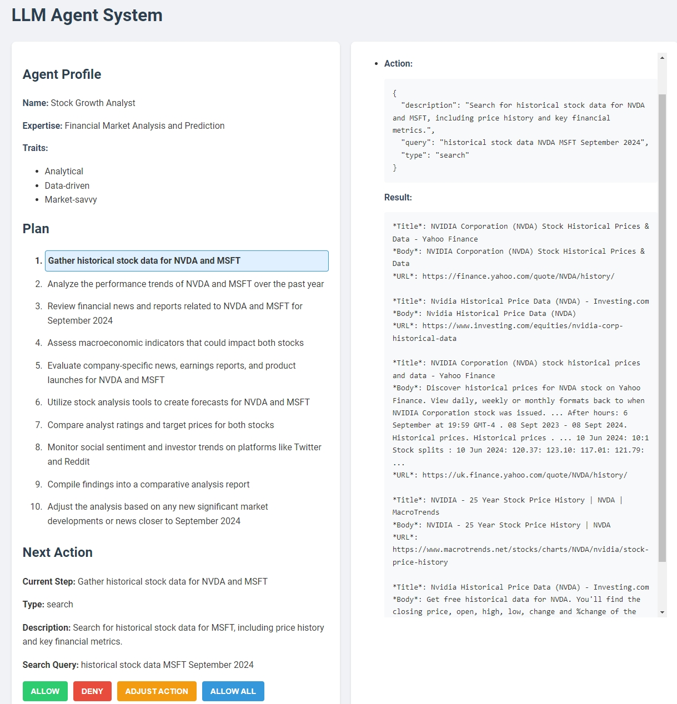

# LLM Agent System

## Overview

The LLM Agent System is an innovative AI-powered task execution platform that leverages Large Language Models (LLMs) to autonomously plan and execute complex tasks. This system creates an agent that can break down a given goal into steps, determine appropriate actions, and execute them to achieve the desired outcome.

## Features

- **Autonomous Planning**: The agent creates a step-by-step plan to achieve the given goal.
- **Dynamic Action Execution**: Supports various action types including Python code execution, web searches, LLM queries, web page visits, file writing, and command-line operations.
- **Persistent Python Environment**: Maintains a Python environment across actions for consistent variable states.
- **Project File Management**: Creates a unique project folder for each task, allowing file operations within a contained environment.
- **Interactive User Interface**: Provides a web-based UI for creating agents, monitoring progress, and intervening when necessary.
- **Flexible Backend Support**: Supports multiple LLM backends, with OpenAI as the default.

## Web UI Screenshot



## Run

   Run the application:
   ```
   python main.py
   ```

5. Open a web browser and navigate to `http://localhost:5000` to access the user interface.

## Usage

1. Enter a goal for the agent in the provided input field.
2. Select the desired LLM backend (OpenAI is the default).
3. Click "Create Agent" to initialize the agent with the given goal.
4. The agent will generate a plan and start proposing actions.
5. For each action, you can choose to:
   - Allow: Execute the action.
   - Deny: Skip the action and move to the next one.
   - Adjust: Modify the action before execution.
   - Allow All: Automatically execute all remaining actions.
6. Monitor the agent's progress in the Memory section.
7. View files created by the agent in the Project Files section.
8. Once all steps are completed, generate a conclusion to summarize the results.

## Action Types

- **Python**: Executes Python code in a persistent environment.
- **Search**: Performs a web search using DuckDuckGo.
- **Ask LLM**: Queries the LLM for additional information.
- **Adjust Plan**: Modifies the existing plan based on new information.
- **Visit Page**: Retrieves and processes content from a specified URL.
- **Write to File**: Creates or updates files within the project folder.
- **Command**: Executes shell commands within the project folder.

## Security Considerations

- The system executes Python code and shell commands. Ensure proper security measures are in place when deploying in a production environment.
- Implement additional validation and sanitization for user inputs and LLM outputs to prevent potential security risks.


## Disclaimer

This software is provided "as is", without warranty of any kind, express or implied, including but not limited to the warranties of merchantability, fitness for a particular purpose and noninfringement. In no event shall the authors or copyright holders be liable for any claim, damages or other liability, whether in an action of contract, tort or otherwise, arising from, out of or in connection with the software or the use or other dealings in the software.

Users are responsible for checking and validating the correctness of their configuration files, safetensor files, and binary files generated using the software. The developers assume no responsibility for any errors, omissions, or other issues coming in these files, or any consequences resulting from the use of these files.


## License

[Apache 2.0](https://choosealicense.com/licenses/apache-2.0/)

## Discord Server

Join our Discord server [here](https://discord.gg/xhcBDEM3).

## Feeling Generous? 😊

Eager to buy me a cup of 2$ coffe or iced tea?🍵☕ Sure, here is the link: [https://ko-fi.com/drnicefellow](https://ko-fi.com/drnicefellow). Please add a note on which one you want me to drink?